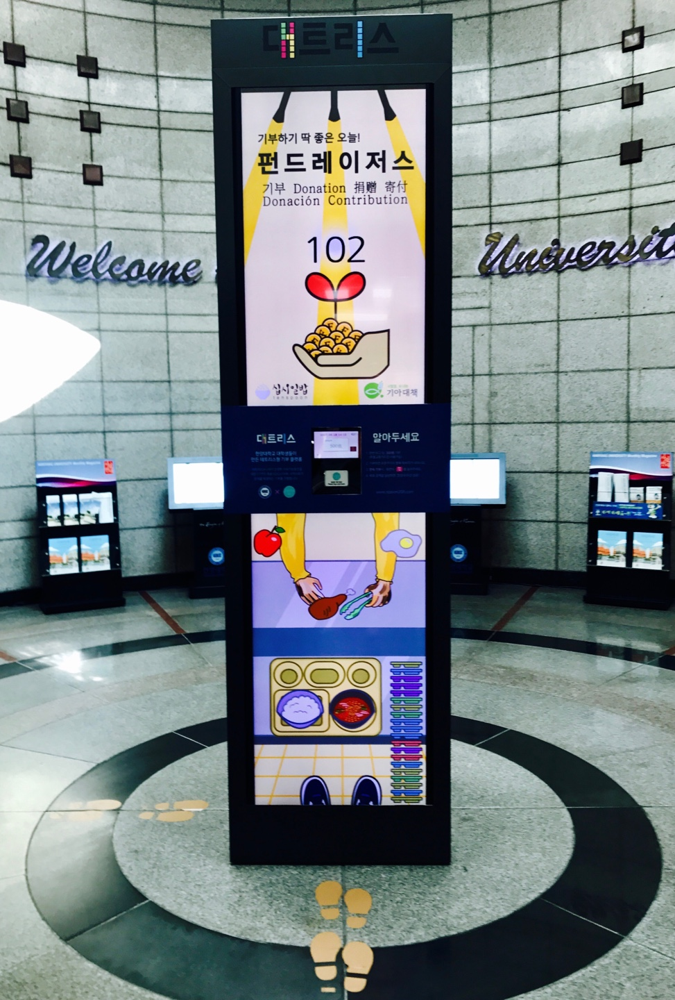
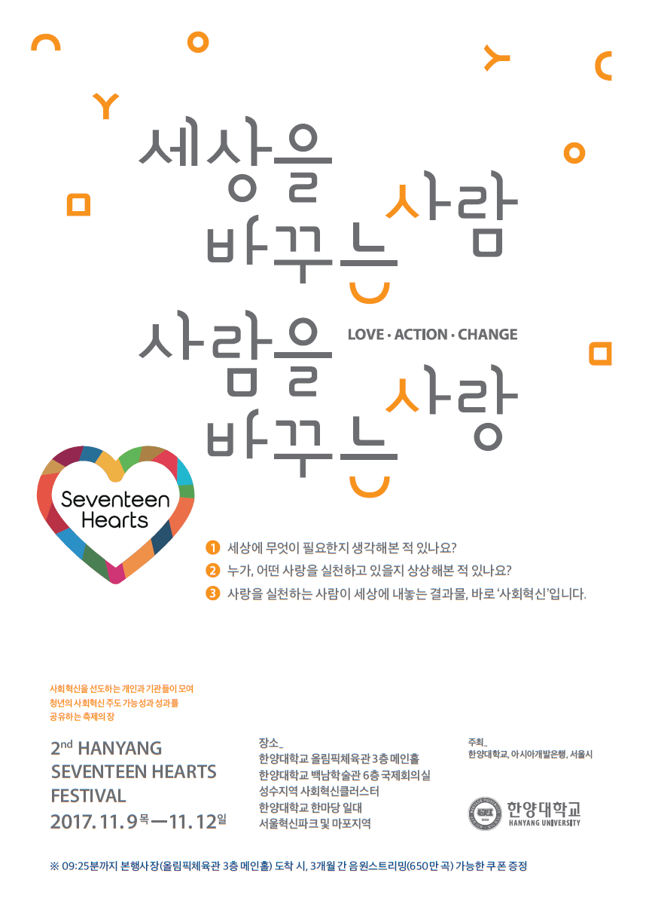
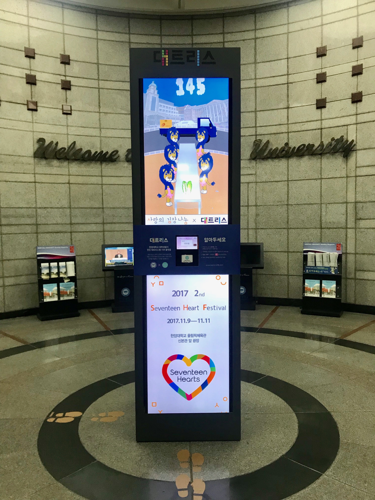

---

# 대트리스란?

한양대학교역에 설치된 대학생 소액 기부 플랫폼 **대트리스**는 한양대학교 학생들이 설립한 소셜벤쳐 **station 208**의 프로젝트에서 시작했다. 창립자들은 **‘쉽고 재밌는 소액기부'** 라는 슬로건 아래 프로젝트를 진행하여 지하철역이라는 접근이 용이한 장소에 테트리스라는 흥미로운 컨텐츠를 접목시켰다. 기부를 하면 컨텐츠마다 다양한 효과를 시청각적으로 나타내주어 기부를 하는 사용자로 하여금 재미를 선사한다.

학생들의 주머니 사정을 고려하여 기존의 큰 금액 위주의 기부형태에서 후불교통카드를 이용한 소액 기부형태로 만들어졌기 때문에 모든 학생이 부담없이 참여할 수 있다. 매달 다른 주제로 만들어진 컨텐츠로 학생들의 많은 관심을 이끌고 그렇게 모금된 기부금은 주로 저소득층 학생들을 위해 사용되고 있다.

---

## 1. 대트리스 x 펀드레이저스

 한양대학교 기금활동 단체 **펀드레이저스**와 **십시일밥**, **기아대책** 과 함께한 프로젝트로 모금된 기금은 한양대 내 취약계층 학우들에게 기부된다. 
[한양대학교 펀드레이저스 Facebook](https://www.facebook.com/607244899663463/photos/pcb.612136362507650/612136179174335/?type=3&theater)
 

> 

---

## 2. 2017 2nd Seventeen Hearts Festival

2017년 11월 9일부터 12일까지 올림픽체육관, 백남학술정보관, 한마당 등 한양대 곳곳에서 열리는 **사회혁신 축제**를 학생들에게 알리고 참여를 독려하기 위한 프로젝트다. 축제 메인 이벤트 중 하나인 **사랑의 김장나눔**과 관련하여 김장김치를 담는 과정을 재미있는 컨텐츠로 제공하였다.

>

> 

---
